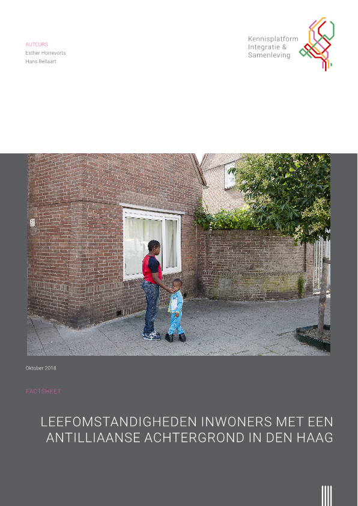

--- 
title: "Leefomstandigheden inwoners met een Antilliaanse achtergrond in Den Haag"
author: "Esther Horrevorts,Hans Bellaart"
date: "September 2018"
site: bookdown::bookdown_site
output: bookdown::gitbook
documentclass: book
bibliography: DHlit.bib
biblio-style: apalike
description: "Uitgave van Kennisplatform Integratie & Samenleving"
---


```{r, echo=FALSE, out.width="50%"}


```

Dit is een uitgave van het Kennisplatform Integratie & Samenleving.

https://www.kis.nl/

https://www.verwey-jonker.nl/

Auteurs:

https://www.verwey-jonker.nl/over-ons/medewerkers/esther-horrevorts

https://www.verwey-jonker.nl/over-ons/medewerkers/hans_bellaart

[Hier](https://www.kis.nl/publicatie/leefomstandigheden-inwoners-met-een-antilliaanse-achtergrond-den-haag) is het oorspronkelijke rapport te vinden. 
